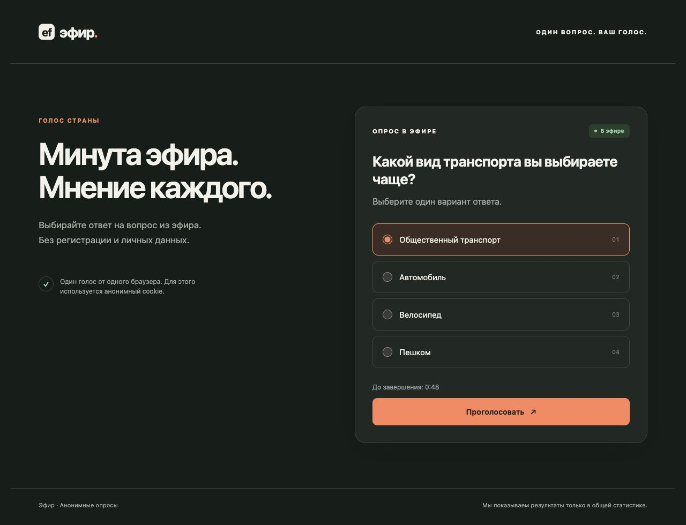
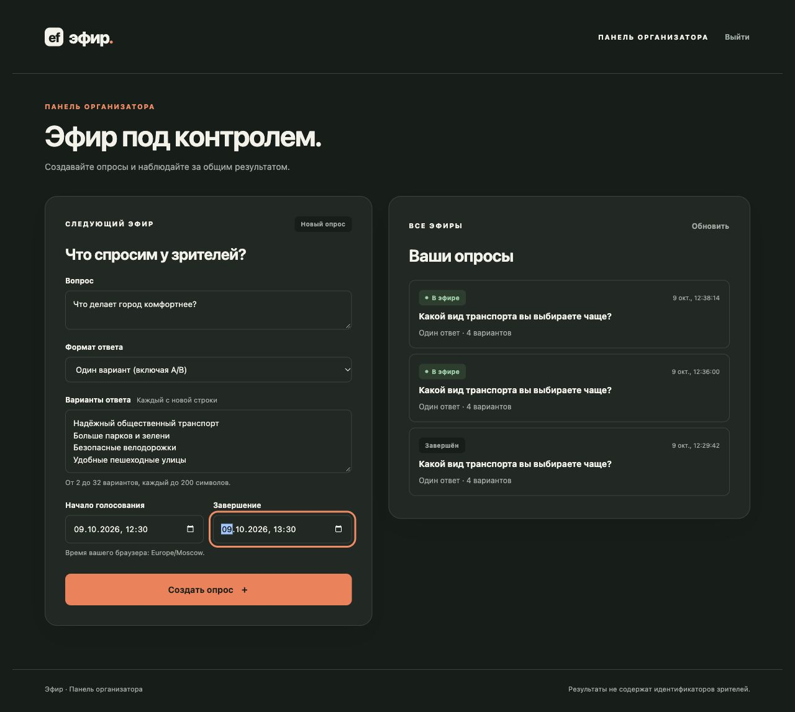
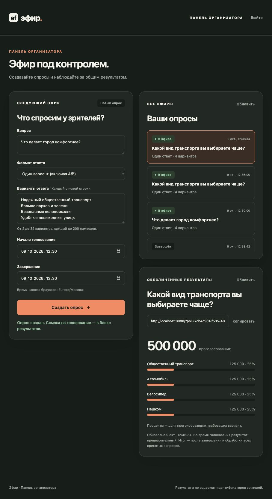
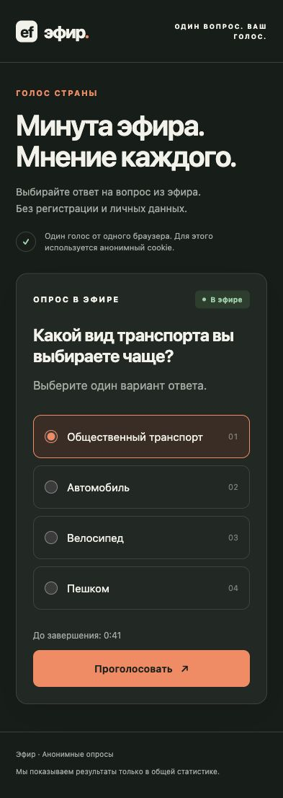
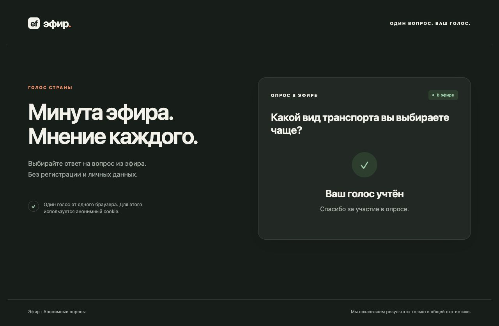
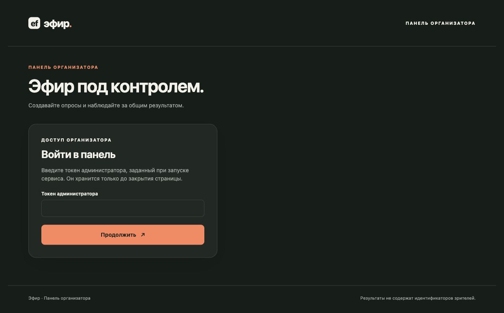
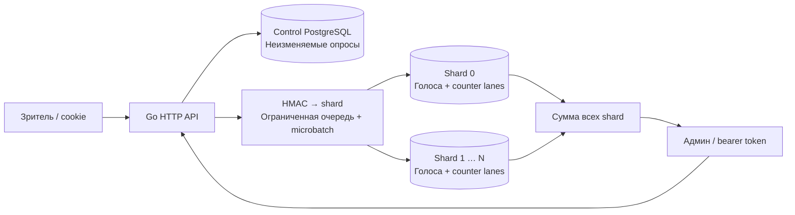

# эфир. — голос страны за минуту

[](https://github.com/emelvv/tvpoll/actions/workflows/ci.yaml)


[](LICENSE)

Анонимные опросы для телевизионного эфира: **один вопрос, голосование без регистрации, создание опросов и обезличенные результаты в админке**. Рабочий Go backend и небольшой интерфейс, запускаемые одной командой Docker Compose.

**100 млн голосов за 60 секунд = 1,67 млн новых голосов/с.** Реализация показывает атомарный учёт, дедупликацию, группировку записей и горизонтальное разделение данных. Для национального эфира нужны распределённая инфраструктура и испытания из [capacity plan](docs/capacity.md). Локальный результат ниже — измерение конкретной машины, а не обещание мощности кластера.



## Попробовать за 3 минуты

Требуется Docker с Compose v2+; Go для этого сценария устанавливать не нужно.

```bash
git clone https://github.com/emelvv/tvpoll.git
cd tvpoll
cp .env.example .env
docker compose up --build -d --wait
sh scripts/smoke.sh
```

Smoke создаёт настоящий опрос, получает cookie для 100 браузерных сессий, принимает голоса, проверяет 20 повторов с другим ответом и сверяет **каждый счётчик**. В JSON появятся `counts_match: true`, `failures: 0` и `voting_url` — откройте эту ссылку в браузере.

Админка: **[localhost:8080/admin](http://localhost:8080/admin)**. Для локального примера токен из `.env.example`:

```text
local-demo-admin-token-9d6e840b7241b05d
```

Создайте свой вопрос, задайте варианты и время, откройте ссылку из результатов. Для минутного эфира установите окно в 60 секунд. Повторите голосование в том же браузере: первый ответ сохранится, счётчик не увеличится. Обновите результаты в админке.

В `.env.example` только демонстрационные значения. Для другого окружения используйте отдельные случайные `ADMIN_TOKEN`, `COOKIE_SECRET`, `DEDUP_SECRET`, HTTPS, `COOKIE_SECURE=true` и точный `PUBLIC_ORIGIN`. Настоящий `.env` исключён из Git и Docker build context. Локальные HTTP/DB порты привязаны к `127.0.0.1`.

Остановка: `docker compose down`. Данные остаются в named volumes и переживают перезапуск сервиса.

## Интерфейс в работе

Это снимки запущенного сервиса и настоящих API-операций. Числа в результатах получены нагрузочным клиентом; изображения не являются макетами.

**Создание опроса и список эфиров**



**Обезличенные результаты после 500 000 уникальных сессий**



<details>
<summary>Мобильное голосование, подтверждение и вход в админку</summary>








</details>

Интерфейс поддерживает клавиатуру, светлую/тёмную системную тему, одиночный и множественный выбор. Токен админа хранится в памяти страницы. Внешних JS/CSS/CDN зависимостей у интерфейса нет.

## Почему голос не учитывается дважды

1. `POST /api/session` выдаёт подписанную сервером случайную cookie. Уже существующая действующая cookie сохраняется.
2. Для конкретного опроса сервер вычисляет HMAC от идентификатора браузера. В базе хранится только этот digest, ответ и время приёма; IP не является ключом дедупликации.
3. Digest выбирает shard. Уникальный ключ `(poll_id, voter_digest)` защищает от параллельных повторов на уровне PostgreSQL.
4. Одна SQL-транзакция вставляет новые голоса и увеличивает счётчики **только для вставленных строк**. Ошибка счётчика откатывает и голос.
5. `201 accepted` приходит после завершения записи с `synchronous_commit=on`. При неизвестном результате клиент повторяет запрос с той же cookie. Сохраняется первый записанный ответ.

**Единица защиты — браузерный профиль, а не человек.** Приватное окно, очистка cookie, другой браузер или устройство позволяют голосовать заново. Это базовая защита из задания. Общий IP семьи или мобильного оператора не лишает других людей права голоса. Подробные границы, включая первые параллельные вкладки и повтор после закрытия опроса, описаны в [архитектуре](docs/architecture.md).

Создание опроса тоже идемпотентно: одинаковый `Idempotency-Key` и payload возвращают исходный опрос; другой payload с тем же ключом получает `409`.

## Архитектура и выбор технологий



| Выбор | Зачем |
| --- | --- |
| Go + `net/http` | Конкурентные запросы, ограниченные очереди, один бинарник, стандартные таймауты и graceful shutdown. |
| PostgreSQL + pgx | Durable WAL, уникальность и атомарный учёт в одной транзакции; конкурентные операции проверяются на настоящей БД. |
| Шардирование по digest | Один популярный опрос распределяет записи между базами. Разделение только по `poll_id` оставило бы горячий shard. |
| Microbatch + counter lanes | Меньше round trips/commits; отдельные счётчики writer workers уменьшают конкуренцию за одну строку результата. |
| Неизменяемые metadata | Кэшировать вопрос безопасно. Голосование не обращается к control DB при каждом попадании в кэш. |
| Bounded admission | При перегрузке быстрый `503` с `Retry-After`; память и число активных обработчиков ограничены. |
| Один SQL commit | Голос, дедупликация и результат не расходятся между Redis, очередью и БД при частичном сбое. |

Локально запущены **три независимые PostgreSQL базы**: metadata и два voting shards. Реализована проверка persisted shard identity: два URL одной физической базы не смогут дважды увеличить суммарные результаты. Production CDN, writer groups, репликация/fencing/failover и versioned shard map описаны как дополнительные компоненты в [architecture.md](docs/architecture.md), а не выданы за готовую инфраструктуру.

При недоступности хотя бы одного voting shard результаты возвращают `503`, а не неполную сумму. Во время голосования чтения нескольких shard дают предварительный срез; после закрытия и завершения принятых записей — окончательный результат. Для множественного выбора сумма процентов может быть больше 100%.

## Проверки и измерения

Для тестов нужен **Go 1.26.9+**. Из корня репозитория:

```bash
go test -race ./...             # unit/HTTP tests; DB tests пропускаются без env
sh scripts/test-integration.sh  # реальные локальные PostgreSQL из Compose
go vet ./...
go run golang.org/x/vuln/cmd/govulncheck@v1.8.0 ./...
sh scripts/benchmark.sh 10000 128
```

Интеграционный сценарий проверяет гонки создания, конкурентные повторы, первый ответ в batch, multi-choice/bit31, атомарный rollback, сохранность после reconnect, недоступный shard, alias одной базы и обязательный durable commit. HTTP-тесты клиента воспроизводят потерянное подтверждение, проверяют неизменность cookie/key/payload при retry и обнаруживают неверное распределение counters. [GitHub Actions](.github/workflows/ci.yaml) запускает проверки, сборку контейнера и smoke.

**Фактический длинный локальный прогон, 9 октября 2026:**

| Показатель | Результат |
| --- | ---: |
| Уникальные браузерные сессии | 500 000 |
| Повторы с другим ответом | 100 000 |
| Учитываемые голоса после повторов | 500 000 |
| Ошибки / расхождения counters | 0 / 0 |
| Время полного сценария | 43,37 с |
| Принятые голоса / время полного сценария | 11 528 /с |
| POST vote latency p50 / p95 / p99 | 6,14 / 10,66 / 14,35 мс |

Среда: Docker/Colima Linux VM, **2 CPU и 1,91 GiB RAM**, все три БД, сервер и генератор разделяют VM; concurrency 128, batch 256, четыре workers на shard, `synchronous_commit=on`. Это **closed-loop** тест: новые итерации ждут завершения предыдущих. Время включает чтение вопроса, создание сессий и повторы; latency измеряет отправку голоса. Это не open-loop тест телевизионного пика и не доказательство 100 млн/мин.

Исходный [JSON измерения](docs/evidence/benchmark.json), [smoke](docs/evidence/smoke.json), [вывод тестов](docs/evidence/test-results.txt), [vulnerability scan](docs/evidence/vulnerability-check.txt) и [методика/ограничения](docs/verification.md) включены в репозиторий. После обновления зависимостей сканер сообщил `No vulnerabilities found`.

## API

| Метод | Путь | Доступ |
| --- | --- | --- |
| `POST` | `/api/session` | Анонимно; подписанная cookie |
| `GET` | `/api/polls/{id}` | Анонимно; CDN cacheable metadata, ETag |
| `POST` | `/api/polls/{id}/votes` | Cookie; JSON `{"choices":[0]}` |
| `POST` | `/api/admin/polls` | Bearer + `Idempotency-Key` |
| `GET` | `/api/admin/polls` | Bearer |
| `GET` | `/api/admin/polls/{id}/results` | Bearer; только суммы |
| `GET` | `/healthz`, `/readyz` | Liveness / все БД доступны |
| `GET` | `/metrics` | Bearer; Prometheus text |

Машинный контракт: [OpenAPI](docs/openapi.yaml). Индексы вариантов начинаются с **0**. Есть `single` (в том числе A/B) и `multiple`, 2–32 варианта, min/max choices, интервал до 24 часов. Deadline определяет сервер; принятый до конца окна запрос может завершить commit после закрытия.

## Навигация для ревьюера

- [Архитектура, гарантии, отказы и ограничения](docs/architecture.md).
- [Capacity plan: 100 млн/мин, сеть, WAL, хранение и испытания](docs/capacity.md).
- [Контракт API](docs/openapi.yaml).
- [Как воспроизвести проверки и demo](docs/verification.md).
- [Все артефакты работы с ИИ](docs/ai/README.md).
- [Исходное задание](docs/ai/task.md).

```text
cmd/server        запуск сервиса и завершение работы
cmd/load          HTTP smoke / closed-loop benchmark
internal/api      анонимный и административный API, cookie, валидация
internal/ingest   admission, очереди, microbatch workers
internal/store    pgx, миграции, атомарные голоса и counters
web               встроенный в бинарник интерфейс
docs              архитектура, OpenAPI, evidence, screenshots, журнал ИИ
```

Лицензия: [MIT](LICENSE).
