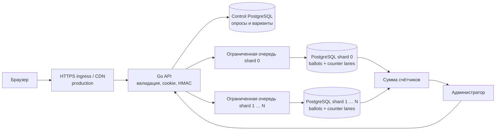

# Архитектура и гарантии

TV Poll — сервис одного вопроса с анонимным голосованием и отдельным административным API. Основное требование к данным: один браузер может дать не более одного учитываемого ответа на один опрос; повтор HTTP-запроса не увеличивает результат. Основное требование к мощности: 100 млн голосов за минуту требуют распределённой системы, а не заявления о производительности одного локального контейнера. Расчёты и условия проверки находятся в [capacity.md](capacity.md).

## Граница реализации

Репозиторий содержит Go HTTP API, страницу голосования, административную страницу, PostgreSQL-хранилище, ограниченные очереди записи и группировку запросов в небольшие транзакции. Сервис принимает конфигурацию нескольких PostgreSQL-хранилищ голосов; локальная конфигурация нужна для проверки поведения и не моделирует сотни физических машин. Точный HTTP-контракт находится в [openapi.yaml](openapi.yaml).

CDN, географический ingress, автоматическое переключение PostgreSQL, управление репликами, распределённая конфигурация, защита от объёмного DDoS и оркестрация сотен узлов — **проект production-развёртывания**, а не включённая инфраструктура. Проверки корректности и локальный нагрузочный прогон не доказывают способность обслужить 100 млн зрителей.

## Путь запроса



1. Администратор создаёт вопрос, допустимые варианты и интервал голосования. Его API защищён секретным bearer-токеном; секрет передаётся через окружение. Публичный ответ содержит только данные, необходимые зрителю.
2. Публичный `GET /api/polls/{id}` возвращает metadata без cookie и допускает shared caching. Отдельный `POST /api/session` выдаёт подписанный случайный идентификатор в cookie; при наличии действующего идентификатора он сохраняется. Идентификатор общий для браузера, а digest для хранения вычисляется отдельно для каждого опроса. Это не имя, аккаунт, номер телефона или IP-адрес.
3. API проверяет опрос, временной интервал, подпись cookie, формат ответа, существование вариантов и ограничения выбора. Проверки выполняются до постановки задания на запись.
4. Из идентификатора и ID опроса вычисляется HMAC digest. Digest выбирает один shard; любой экземпляр API с той же конфигурацией вычисляет тот же маршрут.
5. При заполнении очереди API быстро отклоняет запрос и предлагает повтор. После enqueue HTTP-обработчик ждёт подтверждения не более пяти секунд; затем возвращает `503 outcome_unknown` с `Retry-After: 1`. Уже допущенная запись продолжает обработку независимо от HTTP cancellation. Попадание в память само по себе не считается успешным голосованием.
6. Writer объединяет задания и записывает новые ballots вместе с приращениями счётчиков. Ответ об успехе выдаётся после успешного durable commit. API возвращает `201 accepted` для новой записи и `200 already_voted` для повтора.

Создание опроса тоже идемпотентно: обязательный `Idempotency-Key` резервируется в той же транзакции, что metadata. Одинаковые key и нормализованный payload возвращают прежний опрос, другой payload — `409 idempotency_conflict`. Повтор работает и после закрытия; API допускает создание прошлых временных окон. ID опроса генерируется сервером, а UTC normalization и значения по умолчанию входят в сравнение payload.

Временной интервал голосования проверяется на сервере. Устроенное таким образом голосование требует заранее опубликованного неизменяемого опроса: изменение вариантов, HMAC-ключей или карты shard во время эфира меняет правила учёта. Клиентские часы и таймер на странице не определяют допуск.

## Дедупликация и анонимность

Единица дедупликации — **браузерный профиль с сохранённой cookie**, а не человек. Двойное нажатие, обновление страницы и повтор после сетевой ошибки не добавляют голос. Очистка cookie, приватное окно, другой браузер или устройство позволяют проголосовать снова. Это осознанная граница базовой защиты из задания; регистрация, CAPTCHA для каждого зрителя и fingerprinting не требуются.

Подпись cookie предотвращает самостоятельное изготовление произвольных действующих идентификаторов без ключа. Она не запрещает получить новые cookie обычным публичным запросом. Cookie содержит 128 случайных бит, имеет срок годности один год, `HttpOnly`, `SameSite=Lax` и включаемый `Secure`; production требует HTTPS и `Secure`. Одновременно открытые первые вкладки до появления cookie могут получить разные идентификаторы: это тоже граница browser-based защиты.

Уникальность обеспечивает ключ `(poll_id, voter_digest)` в **одном определённом shard**, а не проверка «есть ли голос» перед вставкой. Передавать клиентский shard ID или доверять клиентскому digest нельзя. Маршрутизация по одному только `poll_id` направила бы весь популярный опрос в одну базу и разрушила горизонтальное масштабирование.

IP не используется как уникальный ключ: семья, общежитие или мобильный оператор могут иметь общий адрес. Ограничение потока по IP в ingress возможно только как мягкая защита от злоупотреблений с учётом NAT; оно не должно создавать правило «один IP — один голос».

В ballots хранится poll-scoped HMAC digest и ответ, а административный API возвращает суммы. Poll-scoped digest уменьшает возможность связать участие одного браузера в разных опросах. При этом это технический псевдоним: сервер видит запросы и cookie, а оператор ingress способен видеть IP. Поэтому здесь «анонимно» означает отсутствие регистрации и персональных полей в результатах, а не криптографическую анонимность. В production access logs должны исключать cookie, bearer-токены и тела голосов; срок хранения технических логов и ballots следует ограничить.

## Атомарный учёт

Ballot — источник истины. Counter lanes — вычисляемый индекс результатов, обновляемый вместе с ballot. Логическая форма записи:

```sql
WITH inserted AS (
  INSERT INTO ballots (...) VALUES (...), (...)
  ON CONFLICT (poll_id, voter_digest) DO NOTHING
  RETURNING poll_id, choices, lane
), delta AS (
  -- Группировка только действительно вставленных строк по option/lane.
  SELECT ... FROM inserted GROUP BY ...
)
INSERT INTO counters (...)
SELECT ... FROM delta
ON CONFLICT (...) DO UPDATE SET count = counters.count + EXCLUDED.count;
```

Это иллюстрация алгоритма, а не копия конкретной миграции. PostgreSQL возвращает через `RETURNING` только действительно вставленные строки. Уникальный индекс разрешает гонку повторов; приращение производится из результата вставки. Поэтому rollback удаляет и ballot, и изменение результата, а повтор после commit не увеличивает счётчик. [Документация PostgreSQL INSERT](https://www.postgresql.org/docs/16/sql-insert.html).

Строка счётчика для популярного варианта не должна быть единственным глобальным lock. Счётчики разделяются на lanes внутри shard; один batch обновляет небольшую группу строк. В реализации lane — индекс ingestion worker, по умолчанию четыре worker на shard. Ballots и counter deltas упорядочиваются по ключам перед записью, чтобы уменьшить возможность deadlock. При нескольких API process lane IDs совпадают: такой deployment требует отдельного измерения lock contention или выделенных production writer groups. Число lanes выбирают по измерениям, а не максимально большим «на всякий случай».

Варианты хранятся как 32-bit mask в `bigint`, а общее число участников — отдельным counter с индексом варианта `-1`. Поддерживаются `single` и `multiple`, от 2 до 32 вариантов, с заданными `min_choices`/`max_choices`. A/B — обычный single-вопрос с двумя вариантами.

Если два запроса одного браузера одновременно отправят разные варианты, учитывается один из них — победитель вставки, а не обязательно первым отправленный пакет. Уже принятый выбор не меняется. Повтор подтверждает существование ранее принятого голоса; он не является голосом за новый выбор.

В `READ COMMITTED` конфликтующий `DO NOTHING` может увидеть уникальный ключ транзакции, строка которой ещё не видна снимку текущего SQL-оператора. Если API понадобится возвращать сохранённый вариант, чтение нужно делать новым оператором после завершения вставки, а не объединять вставку и чтение конфликтующей строки в один CTE. [Документация изоляции PostgreSQL](https://www.postgresql.org/docs/16/transaction-iso.html).

## Успех, перегрузка и сбои

| Ситуация | Гарантия / действие |
| --- | --- |
| Успешный HTTP-ответ после commit | Голос сохранён при выбранной политике PostgreSQL durability. |
| Очередь заполнена | Голос ещё не принят; клиенту нужен повтор с той же cookie. |
| API умер до commit | В памяти могли пропасть ожидающие задания; успех им не обещан. Повтор безопасен. |
| Соединение оборвалось после отправки commit | Исход неизвестен клиенту. Повтор с той же cookie либо запишет голос, либо обнаружит прежний; повторный счёт невозможен. |
| База недоступна | Затронутые запросы не получают успешного подтверждения; ограниченная очередь не превращается в безразмерный буфер. |
| Один shard недоступен при чтении результатов | Нельзя выдавать сумму остальных как полный итог. API должен сообщить ошибку/неполноту. |
| Ответ HTTP потерялся | На сервере голос может быть принят. Отсутствие ответа не означает отсутствие ballot. |

Окончание окна имеет приоритет над повтором: после `closes_at` vote API возвращает `409 poll_closed` даже для уже принятого digest. Поэтому потерянный ответ непосредственно перед концом эфира нельзя восстановить повтором после закрытия. Итоговые данные остаются сохранёнными; отдельный endpoint проверки персонального receipt не реализован. Запрос, допущенный перед закрытием, может завершить commit после него, поэтому сразу в момент закрытия результаты ещё могут измениться.

Памятная очередь сокращает число SQL-транзакций, но не является durable message broker. Добавлять Kafka только для того, чтобы ответить до сохранения, означало бы другую гарантию API: «событие принято в журнал», а не «голос учтён». Для короткого эфира выбран прямой commit и bounded backpressure. Durable журнал с асинхронным подсчётом остаётся альтернативой, если бизнес согласен на отдельное состояние «ожидает обработки» и обслуживаемую инфраструктуру журнала.

Соединения сервиса принудительно устанавливают `synchronous_commit=on`, включая случай более слабой настройки в connection URL. Локальная конфигурация использует стандартный `fsync=on`; отключение `fsync` на стороне PostgreSQL не защищается этой настройкой соединения и недопустимо для заявленной durability. Без настроенных synchronous standbys `on` ждёт только локальную запись WAL. Для сохранения подтверждённых голосов при потере primary production требует synchronous replica и контролируемого failover. Это увеличивает latency и при недоступности необходимой реплики может остановить приём. [PostgreSQL WAL settings](https://www.postgresql.org/docs/16/runtime-config-wal.html).

Результат, прочитанный во время эфира с разных shard, не имеет единого распределённого момента снимка. Он показывает успешно завершённые записи на момент отдельных запросов, без «наполовину записанного» ballot внутри одного shard. Точный окончательный результат получают после окончания допуска, завершения очередей, проверки здоровья всех shard и сверки `SUM(counters)` с ballots. Для multiple choice число выбранных вариантов может быть больше числа участников; это разные показатели.

## Почему эти технологии

**Go + `net/http`.** Небольшой статически собираемый сервис, дешёвые конкурентные обработчики, явные context/deadline и простое развёртывание. Размеры заголовков и тела, timeouts, лимит одновременно обслуживаемых запросов и ограничение очереди необходимы: goroutine не отменяет ограничений памяти и соединений. HTTP server предоставляет соответствующие timeout и header-limit настройки. [Документация `net/http`](https://pkg.go.dev/net/http#Server).

**PostgreSQL + pgx.** Уникальный индекс, транзакции, WAL и `INSERT ... RETURNING` дают проверяемый алгоритм без отдельного распределённого mutex и двойной записи «dedup в Redis, ответ в SQL». Шарды делают единицу атомарности локальной. Цена выбора — WAL, индексы, replication traffic и эксплуатация большого числа баз; масштаб нельзя доказать ссылкой на название технологии.

**Microbatch + lanes.** Малые пакеты амортизируют network round trips и commit; lanes уменьшают lock contention. Большие пакеты увеличивают задержку, объём rollback и время блокировок. Значения batch size, flush interval и pool size должны выбираться по p99 latency, commit latency и queue wait на целевом оборудовании.

**Группы writer в production.** Текущая реализация открывает pools ко всем shard из каждого экземпляра API и создаёт одинаковые worker lane IDs. При сотнях shard и множестве API это создаёт слишком много соединений и contention, а batches дробятся. Перед national-scale deployment требуется отдельная согласованная маршрутизация ingress к закреплённым группам writer или иной проверенный способ ограничить fanout. Такой router и управление владельцами shard **не реализованы** в сдаваемом сервисе; добавление ещё сотен API containers к текущей Compose-схеме не считается решением этого ограничения.

**Разделение control/data plane.** Создание опроса — редкая операция, а голосование — массовая запись. Metadata опросов можно кэшировать без чтения control DB на каждый vote. Для production опрос и конфигурация shard должны быть предварительно прогреты и опубликованы до эфира. Тестовый сервис не заменяет распределённый механизм публикации конфигурации.

## Требования к production-развёртыванию

- Прогреть API, соединения, metadata cache и CDN до ролика; реактивный autoscaling опоздает к минутному всплеску.
- Терминировать TLS и отсекать слишком большие/медленные запросы на ingress. Private ответы с cookie нельзя кэшировать как публичный объект. Статическая страница кэшируется отдельно.
- Заморозить карту shard и HMAC-ключи на весь опрос, включая повторы. Изменение числа shard по формуле modulo без миграции переносит тот же браузер в другую базу и даёт дубль.
- Все экземпляры API должны иметь одинаковые `COOKIE_SECRET`, `DEDUP_SECRET` и одинаковый **порядок** `SHARD_DATABASE_URLS`. Различный cookie key сбрасывает идентификаторы, различный dedup key или порядок баз создаёт новые ключи/маршруты для повторов.
- Каждый shard URL должен указывать на отдельную базу данных. При startup сервис читает постоянный UUID из `shard_identity` и отклоняет два URL, разрешившихся в одну shard identity, включая aliases одной базы. Копия базы с тем же UUID также не может выступать дополнительным независимым shard. Проверка различности не закрепляет автоматически порядок URL между deployments — порядок остаётся эксплуатационным инвариантом.
- Использовать single-writer shard, fencing при promotion и проверенную synchronous replication. Active-active базы без общей уникальности не дают требуемую дедупликацию.
- Проверять readiness по реальной доступности хранилищ; мониторить queue depth, p99 queue wait, commits/s, WAL rate, replica lag, duplicate ratio и долю отказов. Не размещать poll ID или digest в неограниченных metric labels.
- Перед финализацией результатов дождаться завершения записей и проверять все shard. При аварийном завершении процесса незавершённые задания повторяют клиенты.
- Делать schema migration и resharding вне эфира; тестировать backup restore, потерю primary, отказ реплики и потерю площадки. Здесь нет заявленного измеренного RTO.

## Что проверяют тесты

Проверки должны покрывать повтор и гонку одного cookie, different choices при повторе, неподписанную cookie, неправильный вариант, границы времени, rollback и совпадение итогов с источником истины, работу нескольких независимых shard и ограничение перегрузки. HTTP-only unit test не заменяет интеграционный тест настоящего PostgreSQL: именно уникальный индекс и транзакция обеспечивают важные гарантии.

Документ описывает допустимые гарантии архитектуры. Конкретные проведённые проверки и измерения приведены в README и отчёте нагрузки; непроведённый сценарий здесь не считается проверенным.
